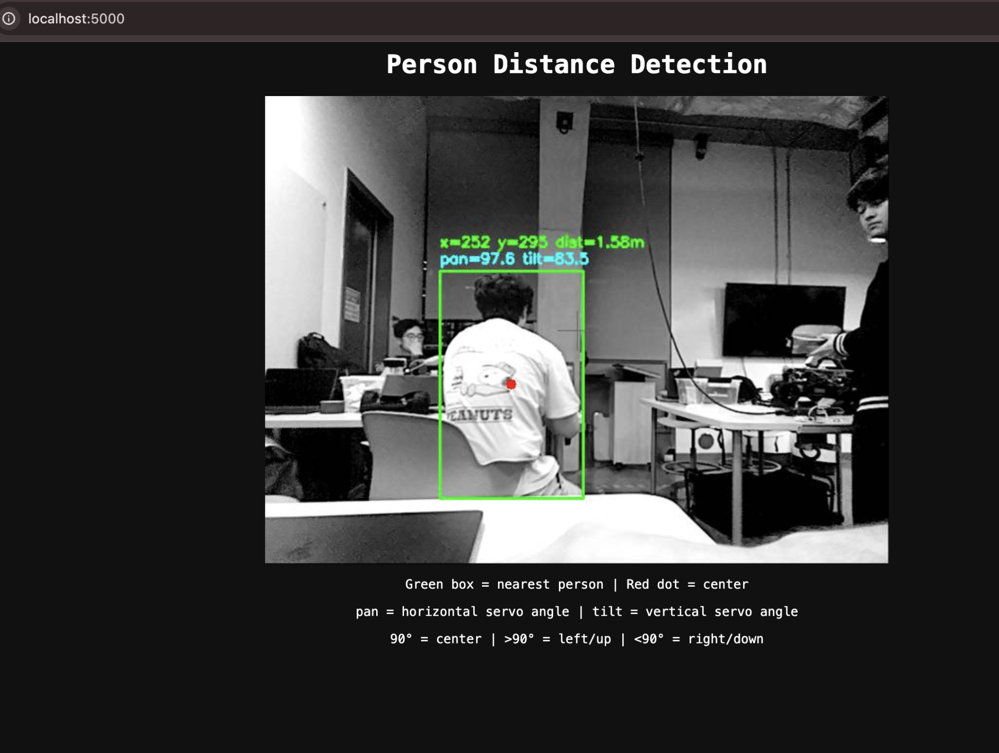

# 🎯 Laser Targeting System for Autonomous Vehicle

A real-time person detection and laser tracking system built for the UCSD ECE 148 autonomous vehicle platform. The system uses computer vision and depth sensing to detect people, calculate their distance, and aim a laser pointer at the nearest detected person.

## 🔍 Overview

This project implements an automated laser targeting system on a Donkey Car-style autonomous vehicle. The system:

1. 👁️ **Detects people** using YOLOv8 neural network
2. 📏 **Measures distance** using OAK-D stereo depth cameras
3. 📐 **Calculates targeting angles** based on pixel position and camera field of view
4. 🔧 **Controls pan/tilt servos** to aim a laser pointer at the target
5. 🌐 **Streams live video** to a web browser for monitoring

### 📸 Web Interface



### 💻 Example Terminal Output

```
(venv) team15@ucsdrobocar-148-15:~/projects/depthai-core $ python person_distance_web_servo.py
Setting up servo controller...

==================================================
LASER TRACKING MODE
Open in browser: http://localhost:5000
(with SSH port forwarding)
==================================================

 * Serving Flask app 'person_distance_web_servo'
 * Debug mode: off
WARNING: This is a development server. Do not use it in a production deployment. Use a production WSGI server instead.
 * Running on all addresses (0.0.0.0)
 * Running on http://127.0.0.1:5000
 * Running on http://172.20.10.2:5000
Press CTRL+C to quit
Servos initialized: pan=ch7, tilt=ch4
Loading YOLO model...
YOLO loaded!
Starting pipeline...
Pipeline running!
FOV: 71.9° horizontal, 56.7° vertical
LASER TRACKING ENABLED - will point at nearest person
[3] x=250, y=325, dist=0.46m | pan=93.3° tilt=87.0° [TRACKING]
[4] x=337, y=352, dist=0.46m | pan=92.6° tilt=83.9° [TRACKING]
[10] No person detected - returning to center
[20] No person detected - returning to center
[25] x=524, y=234, dist=0.68m | pan=84.0° tilt=90.2° [TRACKING]
[26] x=533, y=161, dist=0.96m | pan=79.6° tilt=92.9° [TRACKING]
[27] x=576, y=170, dist=1.29m | pan=74.9° tilt=94.5° [TRACKING]
[29] x=586, y=167, dist=1.75m | pan=74.6° tilt=94.8° [TRACKING]
[30] x=581, y=156, dist=1.95m | pan=71.3° tilt=96.3° [TRACKING]
[33] x=530, y=157, dist=2.31m | pan=77.4° tilt=95.1° [TRACKING]
[34] x=523, y=156, dist=2.56m | pan=75.2° tilt=96.5° [TRACKING]
[35] x=525, y=156, dist=2.36m | pan=73.7° tilt=97.6° [TRACKING]
[37] x=521, y=156, dist=2.38m | pan=76.1° tilt=96.7° [TRACKING]
[38] x=494, y=156, dist=2.50m | pan=75.3° tilt=97.6° [TRACKING]
[39] x=486, y=156, dist=2.72m | pan=75.1° tilt=98.3° [TRACKING]
[40] x=444, y=152, dist=2.72m | pan=76.3° tilt=98.9° [TRACKING]
[41] x=411, y=153, dist=2.88m | pan=78.2° tilt=99.3° [TRACKING]
[42] x=408, y=152, dist=2.69m | pan=79.7° tilt=99.7° [TRACKING]
```

## 🛠️ Hardware Requirements

- 🍓 Raspberry Pi 5 (or similar)
- 📷 OAK-D camera (Luxonis DepthAI)
- 🎛️ PCA9685 16-channel servo controller
- ⚙️ 2x servo motors (pan and tilt)
- 🔴 Laser pointer module
- 🚗 Donkey Car chassis or similar platform

## 🏗️ Software Architecture

### Detection Pipeline

```
OAK-D Stereo Cameras (CAM_B + CAM_C)
         |
         v
    DepthAI Pipeline
         |
    +----+----+
    |         |
    v         v
Left Frame  Depth Map
    |         |
    v         |
  YOLOv8     |
(person det) |
    |         |
    v         v
Bounding Box + Depth Lookup
         |
         v
   Nearest Person (x, y, distance)
         |
         v
   Angle Calculation (pan, tilt)
         |
         v
   Servo Control (PCA9685)
```

### 📐 Angle Calculation

The system converts pixel coordinates to servo angles using the camera's field of view:

- **Horizontal FOV**: 71.9 degrees
- **Vertical FOV**: 56.7 degrees
- **Center position**: 90 degrees (servo neutral)

```python
# Normalize pixel to -0.5 to +0.5 range
nx = (pixel_x / frame_width) - 0.5
ny = (pixel_y / frame_height) - 0.5

# Convert to servo angle
pan_angle = 90 - (nx * HFOV) + offset
tilt_angle = 90 - (ny * VFOV)
```

## 📦 Installation

### 1️⃣ SSH into the Raspberry Pi

```bash
ssh team15@ucsdrobocar-148-15.local
```

### 2️⃣ Navigate to the project directory

```bash
cd /home/team15/projects/depthai-core
```

### 3️⃣ Create and activate virtual environment

```bash
python3 -m venv venv
source venv/bin/activate
```

### 4️⃣ Install dependencies

```bash
pip install -r requirements.txt
```

Or install individually:

```bash
pip install opencv-python numpy depthai ultralytics flask adafruit-circuitpython-servokit
```

### 5️⃣ Download YOLO model (automatic on first run)

The script automatically downloads `yolov8n.pt` on first execution.

## 🚀 Usage

### 🎯 Running the Laser Tracking System

1. SSH into the Pi with port forwarding:

```bash
ssh -L 5000:localhost:5000 team15@ucsdrobocar-148-15.local
```

2. Activate the environment and run:

```bash
cd /home/team15/projects/depthai-core
source venv/bin/activate
python -u person_distance_web_servo.py
```

3. Open in your browser:

```
http://localhost:5000
```

### 💻 Console-Only Mode (No Web Interface)

```bash
python -u person_distance.py
```

Output format:
```
[frame#] x=<pixel_x>, y=<pixel_y>, dist=<meters>m
```

### 🌐 Web Streaming Without Servo Control

```bash
python -u person_distance_web.py
```

## ⚙️ Configuration

### 🔌 Servo Channels

Edit the channel assignments in `person_distance_web_servo.py`:

```python
PAN_CHANNEL = 7   # Horizontal servo (left/right)
TILT_CHANNEL = 4  # Vertical servo (up/down)
```

### 🔴 Laser Offset

If the laser is mounted offset from the camera, adjust the angle offset:

```python
angle_x = 90 - (nx * HFOV) + 6  # +6 degree offset for laser on right side
```

### 🎚️ Smoothing

Control how quickly the servos track the target:

```python
SMOOTHING = 0.3  # 0 = very smooth/slow, 1 = instant/jerky
```

### 🎯 Detection Confidence

Adjust YOLO confidence threshold:

```python
results = yolo(frame_bgr, verbose=False, conf=0.4)  # 0.4 = 40% confidence minimum
```

## 📁 Files

| File | Description |
|------|-------------|
| `person_distance_web_servo.py` | 🎯 Main script with laser tracking + web streaming |
| `person_distance_web.py` | 🌐 Web streaming only (no servo control) |
| `person_distance.py` | 💻 Console output only (no web, no servo) |
| `requirements.txt` | 📦 Python dependencies |

## 🧠 How It Works

### 1. 📷 Stereo Depth

The OAK-D camera uses two mono cameras (CAM_B and CAM_C) to compute stereo depth. By comparing what each camera sees, it calculates the distance to every pixel in the frame.

### 2. 🧍 Person Detection

YOLOv8n (the "nano" variant, optimized for speed) runs on each frame and returns bounding boxes for detected objects. We filter for class 0 (person).

### 3. 📏 Distance Measurement

For each detected person, we sample the depth map at the center of their bounding box. A small 10x10 pixel region is sampled and the median depth value is used for robustness.

### 4. 🎯 Target Selection

When multiple people are detected, the system tracks the **nearest** person (smallest distance value).

### 5. ⚙️ Servo Control

The PCA9685 servo controller communicates over I2C. Servos accept angles from 0-180 degrees, with 90 being the center position.

### 6. 🌐 Web Streaming

Flask serves an MJPEG stream - a series of JPEG images sent rapidly to simulate video. This works in any browser without special codecs.

## 🔧 Troubleshooting

### ❌ Camera not detected

```bash
# Check USB connection
lsusb | grep Luxonis

# Reset USB device if needed
sudo usbreset "03e7:2485"
```

### ❌ Servos not moving

```bash
# Test I2C connection
i2cdetect -y 1

# Should show device at address 0x40 (PCA9685)
```

### ❌ Web page not loading

Make sure you used SSH with port forwarding:
```bash
ssh -L 5000:localhost:5000 team15@ucsdrobocar-148-15.local
```

## 👥 Team

🎓 UCSD ECE 148 - Team 15

📅 Fall 2025
